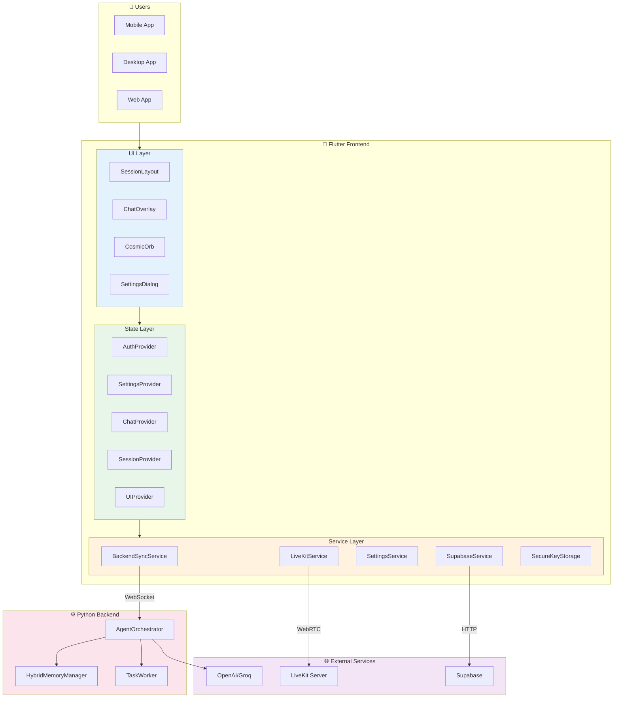
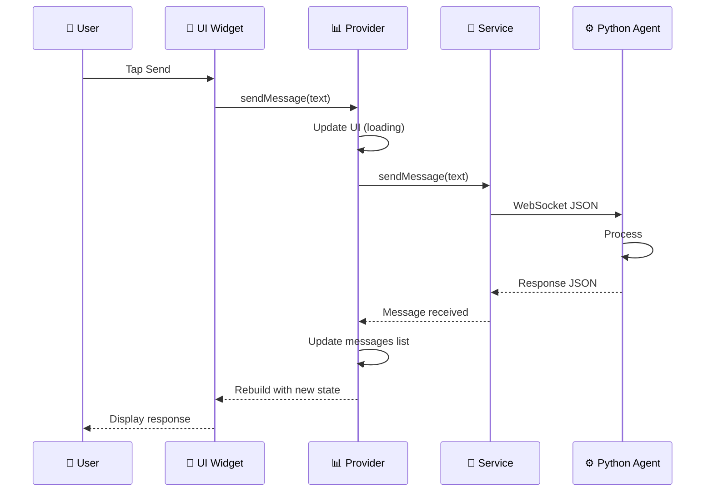
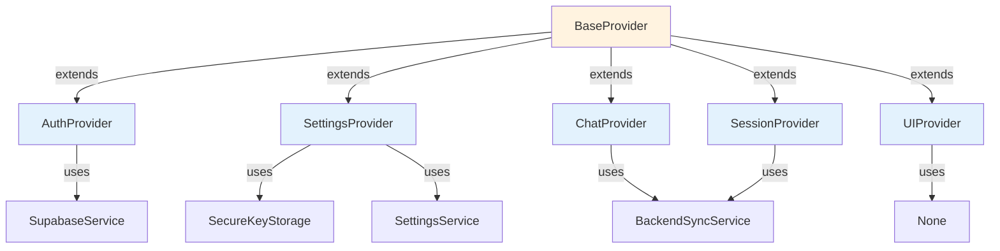
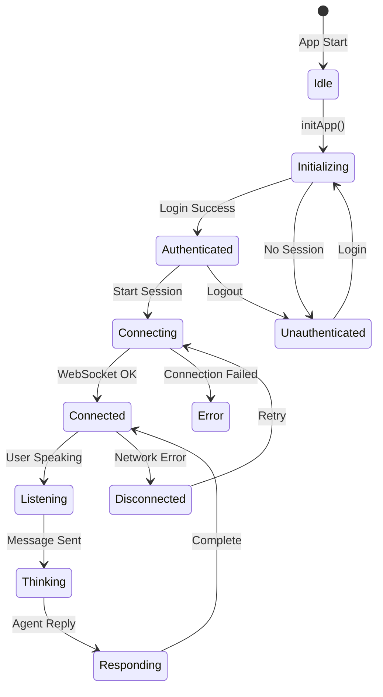
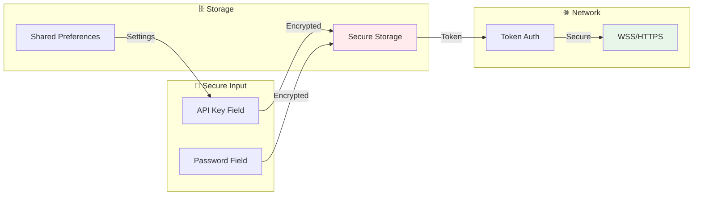
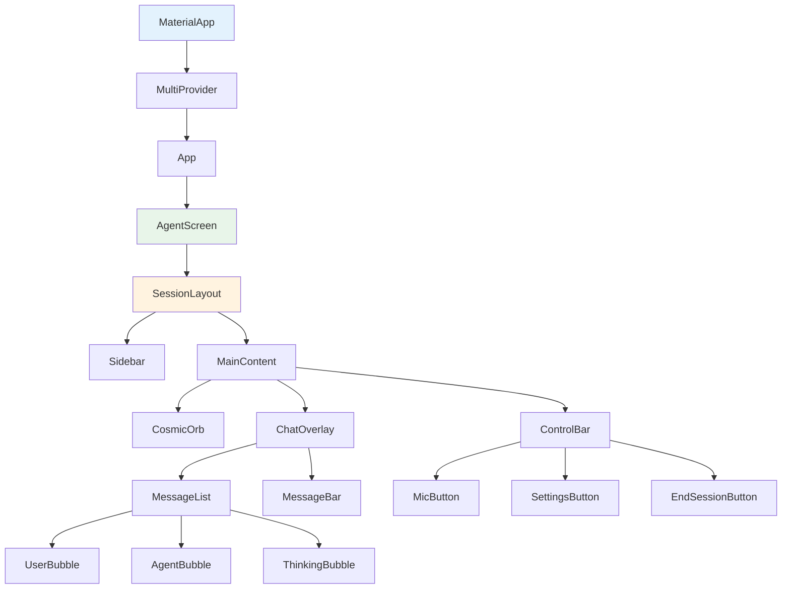

# Flutter Architecture Infographic

## Visual Overview

## Data Flow Architecture

## Provider Hierarchy

## State Management Flow

## Security Architecture

## Widget Tree Structure

## Performance Metrics

| Metric | Target | Current |
|--------|--------|---------|
| App Start Time | < 3s | ~2.5s |
| First Frame | < 1s | ~0.8s |
| Message Latency | < 500ms | ~300ms |
| Memory Usage | < 150MB | ~120MB |
| WebSocket Reconnect | < 3s | ~2s |

## Key Technologies

| Layer | Technology | Purpose |
|-------|------------|---------|
| State | Provider | Reactive state management |
| HTTP | dio | REST API communication |
| WebSocket | websocket | Real-time messaging |
| WebRTC | livekit | Audio/video streaming |
| Storage | hive | Local persistence |
| Secure | flutter_secure_storage | Encrypted credentials |
| Backend | Supabase | Auth & database |

## Related
- [[Flutter-Architecture-Overview]]
- [[State-Management]]
- [[Services-Overview]]
- [[Widget-Catalog]]
