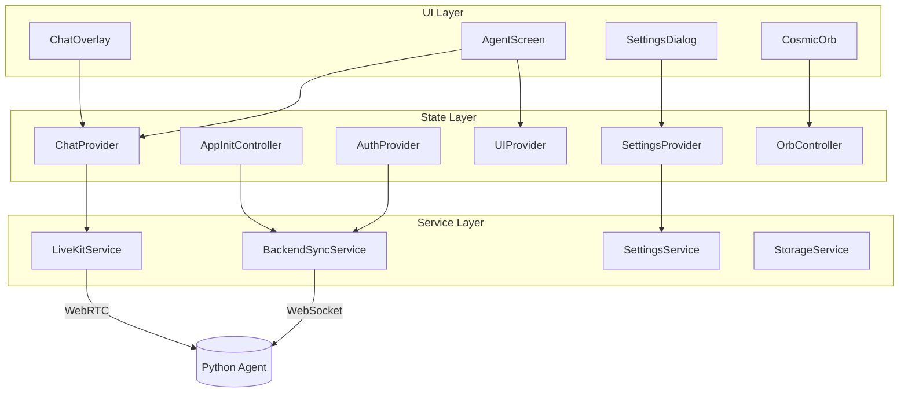
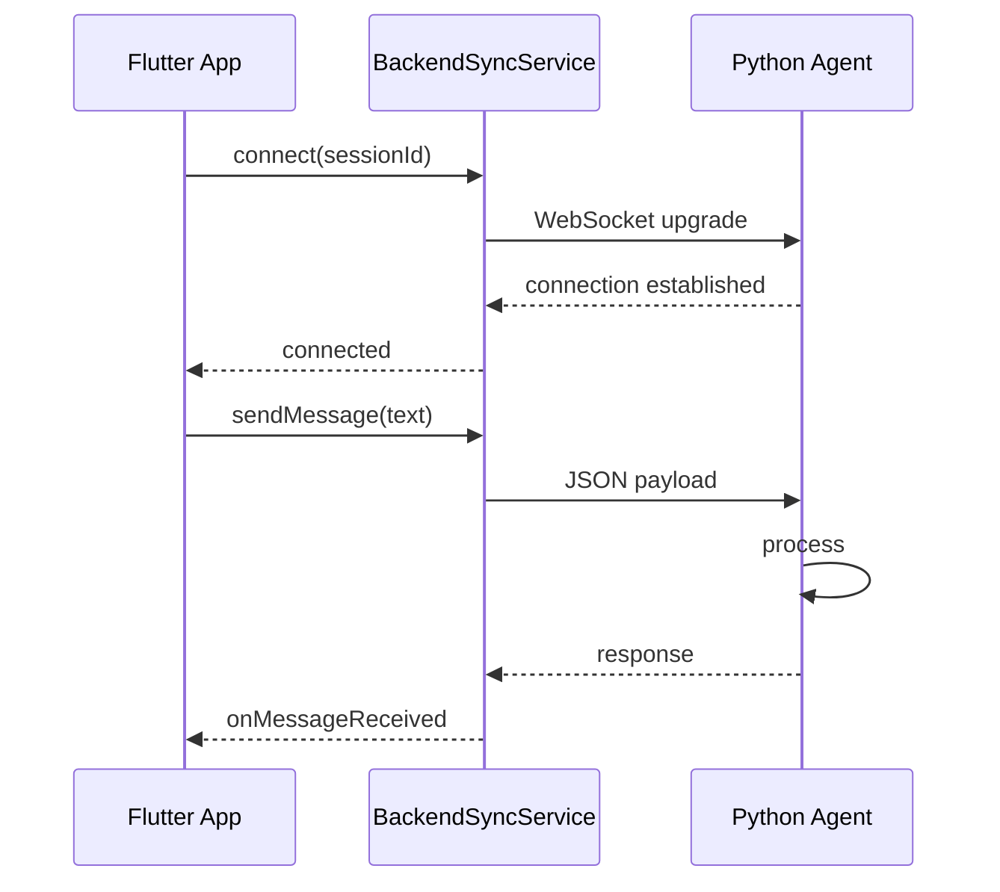

# Flutter Frontend Architecture

## Overview
The Maya AI Flutter frontend provides a cross-platform UI layer that connects to the Python agent backend via WebSocket and REST APIs.

## Architecture Pattern

### State Management
- **Provider Pattern**: Uses `ChangeNotifier` for reactive state
- **BaseProvider**: Abstract base class with loading/error handling
- **Controller Pattern**: Specialized controllers for app initialization and orb state

## Core Services

### BackendSyncService
- WebSocket connection management
- Message serialization/deserialization
- Connection state monitoring
- Auto-reconnection logic

### LiveKitService
- Real-time audio/video streaming
- Room management
- Participant handling
- Track subscriptions

### SettingsService
- Secure key storage
- Settings persistence
- API key management
- Provider configuration

### StorageService
- Local data persistence
- Chat history storage
- Session caching

## Provider Hierarchy

| Provider | Responsibility | Dependencies |
|----------|---------------|--------------|
| AuthProvider | User authentication, session tokens | SupabaseService |
| SettingsProvider | App settings, API keys | SettingsService, SecureKeyStorage |
| ChatProvider | Message history, agent communication | BackendSyncService |
| SessionProvider | Session lifecycle, active session tracking | BackendSyncService |
| UIProvider | UI state, theme, layout mode | None |

## Key Widgets

### Session Widgets
- **SessionLayout**: Main layout container with orb and chat
- **ChatOverlay**: Sliding chat interface
- **SessionErrorBanner**: Error state display

### Orb Widgets
- **CosmicOrb**: Main animated orb visualization
- **ClassicOrb**: Alternative orb style
- **OrbController**: Manages orb animation states

### Chat Widgets
- **AgentThinkingBubble**: "Agent is thinking" indicator
- **ResearchResultBubble**: Research response display
- **SourceCardsPanel**: Citation/source display

### Settings Widgets
- **SettingsDialog**: Main settings container
- **APIKeysPanel**: API key management
- **PersonalizationPanel**: User preferences
- **VoiceAudioPanel**: TTS/STT configuration

## Configuration System

### LLM Configuration
- Provider selection (OpenAI, Groq, Anthropic)
- Model configuration per role
- Temperature and token limits

### TTS/STT Configuration
- Edge TTS integration
- LiveKit voice settings
- Voice activity detection

## Security

### Secure Storage
- API keys encrypted at rest
- Biometric authentication support (mobile)
- Keychain/Keystore integration

### Connection Security
- WSS for WebSocket connections
- Token-based authentication
- Certificate pinning (optional)

## Integration Points

### With Python Agent

## Testing Strategy

### Unit Tests
- Provider state changes
- Service mock implementations
- Controller lifecycle

### Widget Tests
- Settings dialog validation
- Chat bubble rendering
- Error state handling

### Integration Tests
- Full agent communication flow
- Settings persistence
- Session lifecycle

## Status: Phase 8-9 Complete

### Completed Features
- [x] State synchronization with backend
- [x] Settings provider with persistence
- [x] LiveKit audio integration
- [x] Chat overlay UI
- [x] Secure API key storage
- [x] Session management

### Current Focus
- Resilience testing for provider failures
- Widget test coverage expansion
- Performance optimization

## Related
- [[Phase-8-Flutter-State-Synchronization-Plan]]
- [[SettingsProvider]]
- [[BackendSyncService]]
