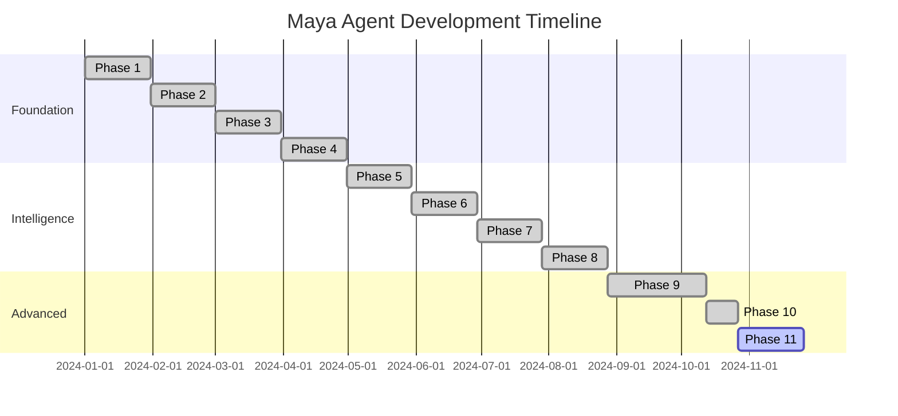
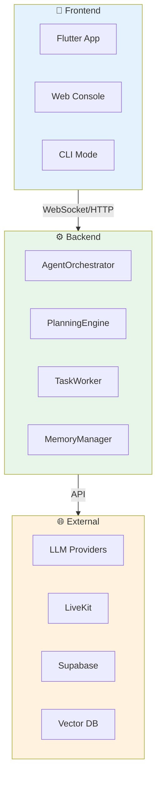
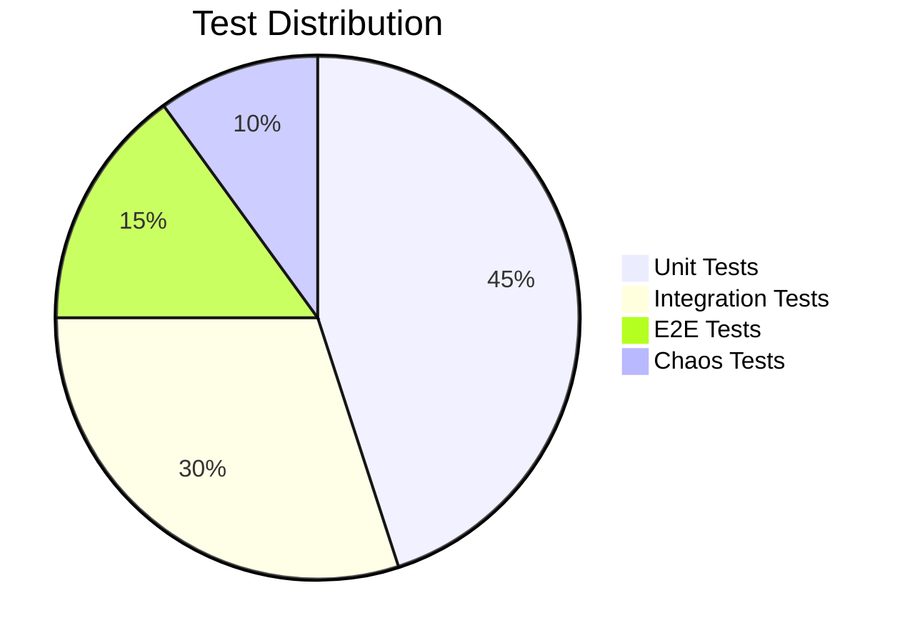
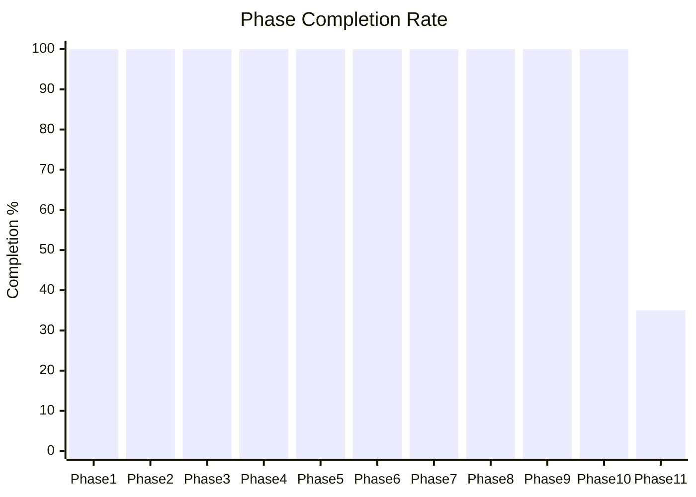
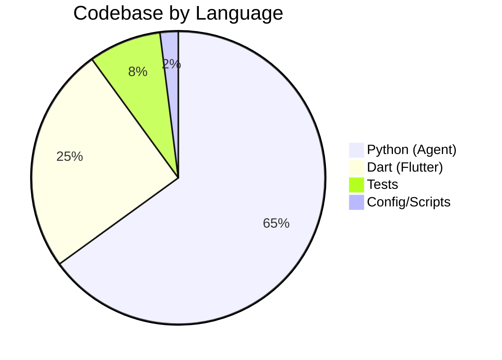
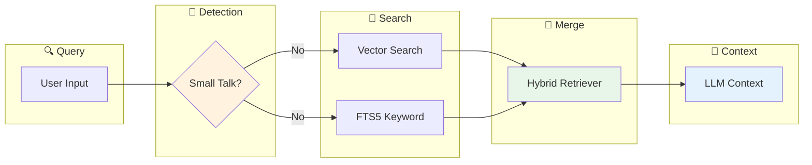
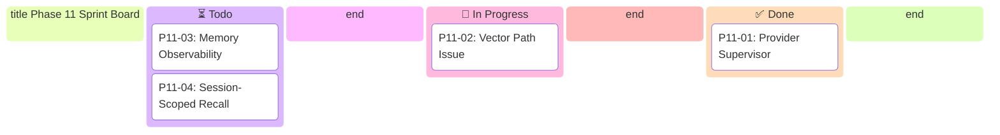
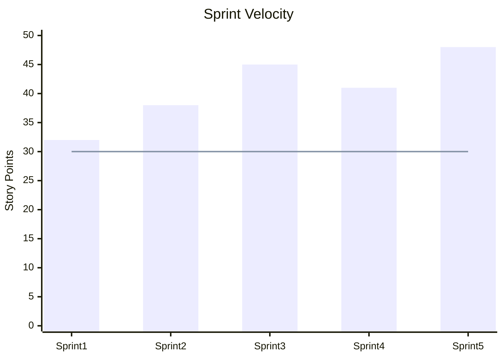
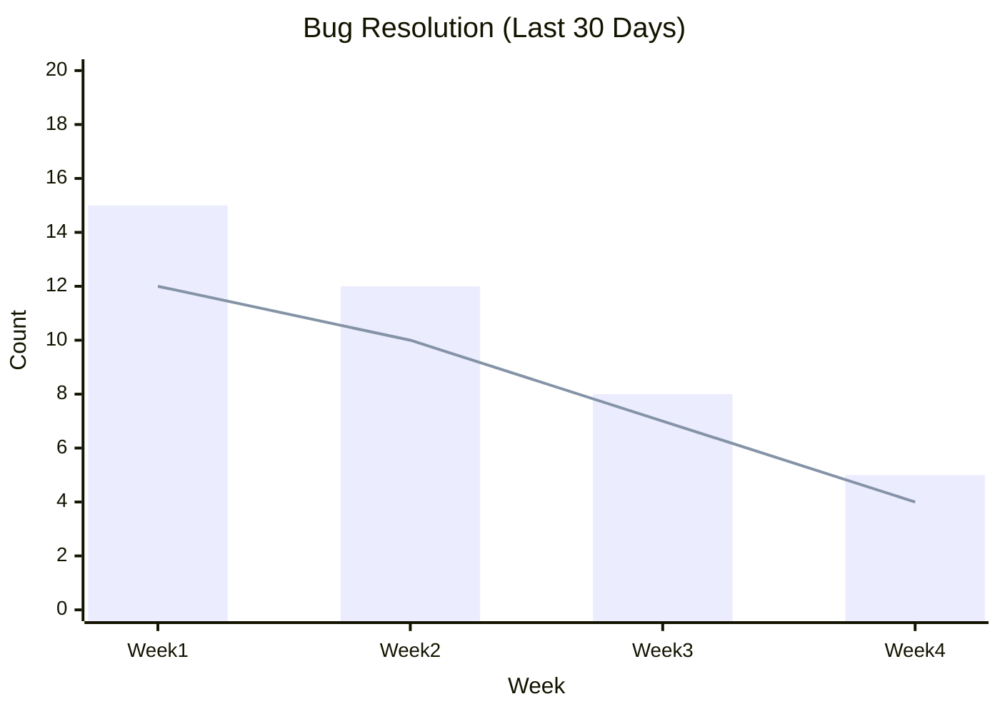

# Maya Project Status Infographic

## Phase Timeline



## System Architecture Overview



## Test Coverage



## Phase Completion Status



## Code Distribution



## Memory System Architecture



## Current Sprint Status



## Commit Activity

```mermaid
heatmap
    title "Commit Activity (Last 7 Days)"
    x-axis Day [Mon, Tue, Wed, Thu, Fri, Sat, Sun]
    y-axis Hour [Morning, Afternoon, Evening, Night]
    data [5, 8, 12, 3, 6, 9, 15, 4, 7, 11, 2, 8, 10, 6, 4, 9, 7, 5, 13, 8, 6, 11, 4, 9, 7, 5, 8, 6]
```

## Team Velocity



## Bug Resolution Trend



## Related
- [[Phase Architecture]]
- [[7-Layer Runtime Chain]]
- [[Flutter-Architecture-Overview]]
