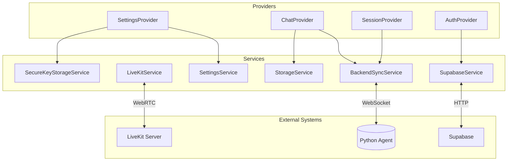

# Flutter Services Overview

## Service Layer Architecture

Services handle external communication and data persistence. They operate below the provider layer.

## Core Services

### BackendSyncService
**File**: `lib/core/services/backend_sync_service.dart`

Manages WebSocket connection to the Python agent backend.

**Responsibilities**:
- WebSocket connection lifecycle
- Message serialization (JSON)
- Auto-reconnection with exponential backoff
- Connection state events

**Key Methods**:
```dart
Future<void> connect(String sessionId)
Future<void> disconnect()
Future<void> sendMessage(String message)
Stream<AgentMessage> get messageStream
Stream<ConnectionState> get connectionState
```

**Configuration**:
- WebSocket URL from environment config
- Reconnection: max 5 attempts, 1-30s backoff
- Heartbeat: 30s interval

### LiveKitService
**File**: `lib/core/services/livekit_service.dart`

Handles real-time audio/video via WebRTC.

**Responsibilities**:
- Room connection management
- Audio track publishing/subscribing
- Participant event handling
- Voice activity detection

**Key Methods**:
```dart
Future<void> connect(String url, String token)
Future<void> disconnect()
Future<void> enableMicrophone()
Future<void> disableMicrophone()
Stream<Participant> get participants
```

**Events**:
- `onTrackSubscribed`
- `onParticipantConnected`
- `onParticipantDisconnected`
- `onConnectionStateChanged`

### SettingsService
**File**: `lib/core/services/settings_service.dart`

Persistence layer for app settings.

**Storage Backends**:
- `shared_preferences` - Non-sensitive settings
- `flutter_secure_storage` - API keys

**Key Methods**:
```dart
Future<String?> getSetting(String key)
Future<void> setSetting(String key, String value)
Future<void> deleteSetting(String key)
Future<Map<String, dynamic>> getAllSettings()
```

### SecureKeyStorageService
**File**: `lib/core/services/secure_key_storage_service.dart`

Encrypted storage for sensitive credentials.

**Security Features**:
- AES encryption
- Keychain (iOS) / Keystore (Android) integration
- Biometric auth (optional)
- No plain-text logging

**Methods**:
```dart
Future<void> storeKey(String keyId, String keyValue)
Future<String?> retrieveKey(String keyId)
Future<void> deleteKey(String keyId)
Future<bool> hasKey(String keyId)
```

### StorageService
**File**: `lib/core/services/storage_service.dart`

Local data persistence for chat history and cache.

**Features**:
- SQLite database (via `sqflite`)
- File system storage for attachments
- Cache eviction policies

**Tables**:
```sql
-- chat_messages
CREATE TABLE chat_messages (
  id TEXT PRIMARY KEY,
  session_id TEXT,
  content TEXT,
  role TEXT,
  timestamp INTEGER,
  metadata TEXT
);

-- session_cache
CREATE TABLE session_cache (
  session_id TEXT PRIMARY KEY,
  last_accessed INTEGER,
  data TEXT
);
```

### SupabaseService
**File**: `lib/core/services/supabase_service.dart`

Backend-as-a-service integration.

**Responsibilities**:
- User authentication
- Database queries
- Real-time subscriptions
- Storage bucket access

## Service Dependencies



## Configuration System

### Shared Config
**File**: `lib/core/config/shared_config.dart`

Environment-specific configuration:
```dart
class SharedConfig {
  static String get websocketUrl =>
    const String.fromEnvironment('WS_URL',
      defaultValue: 'ws://localhost:8000');

  static String get supabaseUrl =>
    const String.fromEnvironment('SUPABASE_URL');
}
```

### Provider Config
**File**: `lib/core/config/provider_config.dart`

LLM provider settings:
```dart
class ProviderConfig {
  static const Map<String, ProviderSettings> providers = {
    'openai': ProviderSettings(
      name: 'OpenAI',
      models: ['gpt-4', 'gpt-3.5-turbo'],
      requiresKey: true,
    ),
    'groq': ProviderSettings(
      name: 'Groq',
      models: ['llama-3.1-70b', 'mixtral-8x7b'],
      requiresKey: true,
    ),
  };
}
```

## Error Handling

All services implement consistent error handling:

```dart
try {
  await service.operation();
} on SocketException catch (e) {
  // Network errors
  throw ConnectionException('Network unavailable', e);
} on TimeoutException catch (e) {
  // Timeout errors
  throw TimeoutException('Operation timed out', e);
} catch (e, stack) {
  // Unknown errors
  Logger.error('Service error', e, stack);
  throw ServiceException('Unexpected error', e);
}
```

## Testing Services

### Mock Service Pattern
```dart
class MockBackendSyncService implements BackendSyncService {
  final _messageController = StreamController<AgentMessage>.broadcast();

  @override
  Stream<AgentMessage> get messageStream => _messageController.stream;

  @override
  Future<void> sendMessage(String message) async {
    // Simulate response
    _messageController.add(AgentMessage(
      content: 'Mock response',
      timestamp: DateTime.now(),
    ));
  }
}
```

## Lifecycle Management

Services follow a lifecycle pattern:

1. **Create**: Lazy initialization
2. **Initialize**: Async setup (if needed)
3. **Active**: Normal operation
4. **Pause**: App backgrounded
5. **Resume**: App foregrounded
6. **Dispose**: Cleanup resources

```dart
abstract class Service {
  bool get isInitialized;
  Future<void> initialize();
  Future<void> dispose();
}
```

## Related
- [[Flutter-Architecture-Overview]]
- [[State-Management]]
