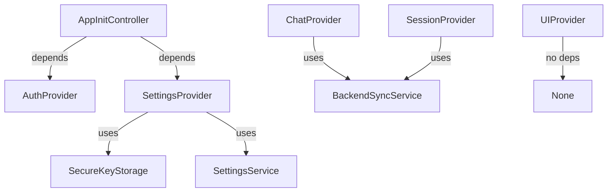

# Flutter State Management

## Provider Architecture

Maya uses the Provider pattern with `ChangeNotifier` for reactive state management across the Flutter app.

## Base Provider

All providers extend `BaseProvider` which provides:
- Loading state management
- Error handling with `setError()` / `clearError()`
- Utility methods for async operations

```dart
abstract class BaseProvider extends ChangeNotifier {
  bool _isLoading = false;
  String? _error;

  Future<T> handleAsync<T>(Future<T> Function() operation);
  void setError(String? error);
  void clearError();
}
```

## Core Providers

### AuthProvider
**File**: `lib/state/providers/auth_provider.dart`

Manages user authentication state.

| Property | Type | Description |
|----------|------|-------------|
| `isAuthenticated` | `bool` | Current auth status |
| `user` | `User?` | Current user object |
| `session` | `Session?` | Active session |

**Methods**:
- `signIn(email, password)`
- `signOut()`
- `refreshSession()`

### SettingsProvider
**File**: `lib/state/providers/settings_provider.dart`

Central configuration management with persistence.

| Property | Type | Description |
|----------|------|-------------|
| `llmProvider` | `String` | Selected LLM provider |
| `openAIKey` | `String?` | OpenAI API key (encrypted) |
| `groqKey` | `String?` | Groq API key (encrypted) |
| `themeMode` | `ThemeMode` | Light/dark/system |
| `voiceEnabled` | `bool` | TTS on/off |

**Key Features**:
- Secure key storage via `SecureKeyStorageService`
- Async initialization with fallback defaults
- Change notification to listeners

### ChatProvider
**File**: `lib/state/providers/chat_provider.dart`

Manages chat messages and agent communication.

| Property | Type | Description |
|----------|------|-------------|
| `messages` | `List<ChatMessage>` | Message history |
| `isAgentThinking` | `bool` | Agent processing state |
| `currentSessionId` | `String?` | Active session |

**Methods**:
- `sendMessage(text)` - Send to agent
- `clearHistory()` - Reset chat
- `appendSystemMessage(content)`

### SessionProvider
**File**: `lib/state/providers/session_provider.dart`

Tracks active session state.

| Property | Type | Description |
|----------|------|-------------|
| `hasActiveSession` | `bool` | Session active status |
| `sessionId` | `String?` | Current session ID |
| `connectionState` | `ConnectionState` | WebSocket state |

### UIProvider
**File**: `lib/state/providers/ui_provider.dart`

Pure UI state (no backend dependencies).

| Property | Type | Description |
|----------|------|-------------|
| `isChatOpen` | `bool` | Chat overlay visibility |
| `selectedLayout` | `LayoutMode` | Agent/classic/none |
| `orbAnimationState` | `OrbState` | idle/listening/thinking |

## Controllers

### AppInitController
Manages app initialization sequence:
1. Load secure storage
2. Initialize Supabase
3. Restore settings
4. Connect to backend
5. Verify API keys

### OrbController
Manages orb animation states:
- `idle` - Default state
- `listening` - User speaking
- `thinking` - Agent processing
- `speaking` - TTS active

## Provider Dependencies



## Usage Pattern

### In Widgets
```dart
// Read-only access
final settings = context.watch<SettingsProvider>();

// One-time read
final apiKey = context.read<SettingsProvider>().openAIKey;

// Listen to changes
Consumer<ChatProvider>(
  builder: (context, chat, child) {
    return MessageList(messages: chat.messages);
  },
)
```

### Provider Setup
```dart
MultiProvider(
  providers: [
    ChangeNotifierProvider(create: (_) => AuthProvider()),
    ChangeNotifierProvider(create: (_) => SettingsProvider()),
    ChangeNotifierProvider(create: (_) => ChatProvider()),
    ChangeNotifierProvider(create: (_) => SessionProvider()),
    ChangeNotifierProvider(create: (_) => UIProvider()),
  ],
  child: MyApp(),
)
```

## Testing Providers

### Mock Pattern
```dart
class MockSettingsProvider extends ChangeNotifier
    implements SettingsProvider {
  @override
  String get openAIKey => 'test-key';

  @override
  Future<void> loadSettings() async {}
}
```

### Async Testing
```dart
test('loads settings on init', () async {
  final provider = SettingsProvider();
  await provider.loadSettings();
  expect(provider.isLoading, false);
});
```

## Best Practices

1. **Single Responsibility**: One provider per domain
2. **Immutable State**: Don't mutate state directly
3. **Notify Listeners**: Always call `notifyListeners()` after changes
4. **Async Error Handling**: Use `handleAsync()` from BaseProvider
5. **Dispose Resources**: Clean up in `dispose()` method
6. **Secure Keys**: Never log API keys or store in plain text

## Related
- [[Flutter-Architecture-Overview]]
- [[Secure-Key-Storage]]
